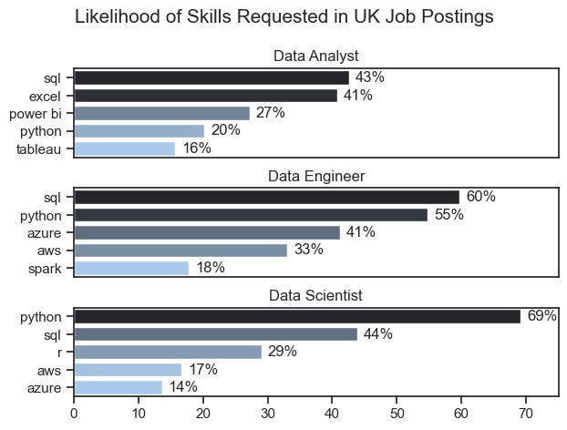
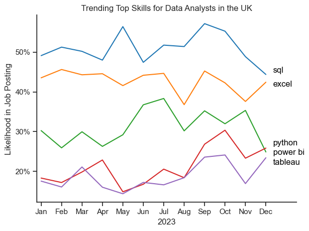
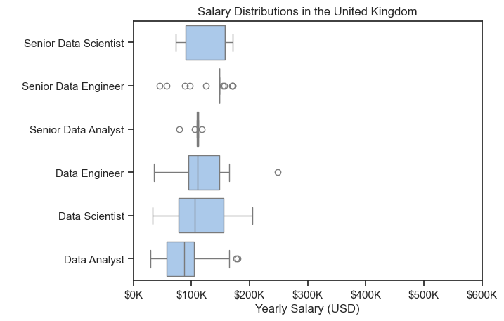
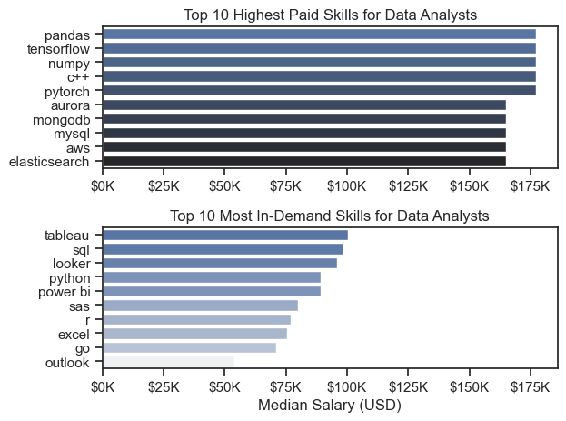
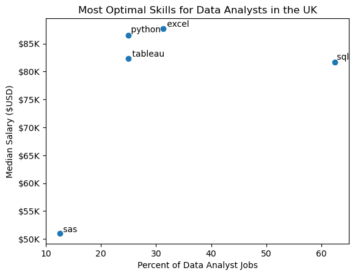
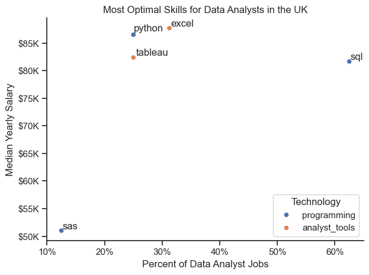

# The Analysis of Data jobs market in United Kingdom

## 1. What are the skills most in demand for the top 3 most popular data roles in UK?

To find the most demanded skills for the top 3 most popular data roles. I filtered out those positions by which ones were the most popular, and got the top 5 skills for these top 3 roles. This query highlights the most popular job titles and their top skills, showing which skills I should pay attention to depending on the role I'm targeting.

View my notebook with detailed steps here: 
[2_Skill_Demand.ipynb](3_Project/2_Skill_Demand.ipynb)

### Visualize Data

```python
fig, ax = plt.subplots(len(job_titles), 1)

sns.set_theme(style='ticks', palette='pastel')


for i, job_title in enumerate(job_titles):
    df_plot = df_skills_perc[df_skills_perc['job_title_short'] == job_title].head(5)
    sns.barplot(data=df_plot, x='skill_percentage', y='job_skills', ax=ax[i], hue='skill_count', palette='dark:b_r')
```
### Results



### Insights

- SQL and Python are the key core skills across all three positions.
- Data Analysts focus more on Excel, Power BI, and reporting.
- Data Engineers need stronger cloud and infrastructure skills, especially Azure and AWS. 
- Data Scientists rely most heavily on Python for advanced analysis and modeling.

## 2. How are in-demand skills trending for Data Analysts?

To find how skills are trending in 2023 for Data Analysts, I filtered data analyst positions and grouped the skills by the month of the job postings. This got me the top 5 skills of data analysts by month, showing how popular skills were throughout 2023.


View my notebook with detailed steps here: 
[3_Skill_Trend.ipynb](3_Project/3_Skill_Trend.ipynb)

### Visualize Data

```python
rom matplotlib.ticker import PercentFormatter

df_plot = df_DA_UK_percent.iloc[:, :5]

sns.set_theme(style='ticks')
sns.lineplot(data=df_plot, dashes=False, palette="tab10")
sns.despine()
```
### Results



### Insights

- SQL remains the most consistently demanded skill throughout the year, reaching its peak around September before declining slightly toward the end of the year.
- Excel stays relatively stable as the second most requested skill, despite a few dips, and remains one of the core tools for data analyst roles.
- Python shows moderate fluctuations, with stronger demand in the middle of the year, confirming its continued importance for analytical and technical tasks.
- Power BI and Tableau are less demanded overall, but both show stronger growth in the second half of the year, suggesting increasing interest in BI and data visualization skills.

## 3. How well do jobs and skills pay for Data Analysts?

To identify the highest-paying roles and skills, I only got jobs in the United States and looked at their median salary. But first I looked at the salary distributions of common data jobs like Data Scientist, Data Engineer, and Data Analyst, to get an idea of which jobs are paid the most.


View my notebook with detailed steps here: 
[4_Salary_Analysis.ipynb](3_Project/4_Salary_Analysis.ipynb)

### Visualize Data

```python
sns.boxplot(data=df_UK_Top6, x='salary_year_avg', y='job_title_short', order=job_order)
sns.set_theme (style='ticks', palette='pastel')

plt.title('Salary Distributions in the United Kingdom')
plt.xlabel('Yearly Salary (USD)')
plt.ylabel(' ')
ax = plt.gca()
ax.xaxis.set_major_formatter(plt.FuncFormatter(lambda y, pos: f'${int(y/1000)}K'))
plt.xlim(0, 600000)
plt.show()
```
### Results



### Insights

- Senior Data Scientist shows the highest salary distribution overall, with the highest median and a relatively wide range, indicating that this role is the most highly rewarded in the UK market.
- Data Scientist and Data Engineer roles display broader salary spreads, suggesting greater variability in compensation depending on experience, company, or specialization.
- Data Analyst has the lowest salary distribution among the listed roles, although there are still a few higher outliers, showing that some positions can pay significantly above the typical range.
- Senior Data Analyst and Senior Data Engineer appear more concentrated around specific salary levels, with several outliers, which may indicate fewer observations or more standardized pay ranges at the senior level.
- Overall, senior positions tend to offer higher salaries than non-senior roles, confirming a clear upward shift in pay with experience and seniority.

## Highest Paid & Most Demanded Skills for Data Analysts 

### Visualize Data

```python
fig, ax = plt.subplots(2, 1)  

# Top 10 Highest Paid Skills for Data Analysts
sns.barplot(data=df_DA_top_pay, x='median', y=df_DA_top_pay.index, hue='median', ax=ax[0], palette='dark:b_r')

# Top 10 Most In-Demand Skills for Data Analystsr')
sns.barplot(data=df_DA_skills, x='median', y=df_DA_skills.index, hue='median', ax=ax[1], palette='light:b')

plt.show()
```
### Results



### Insights

- The top graph shows that specialized technical skills like pandas, TensorFlow, NumPy, C++, and PyTorch are associated with the highest salaries, in some cases reaching around $177K. However, many of these skills appear in only a very small number of job postings, so the results may reflect isolated high-paying roles rather than broad market demand.

- The bottom graph highlights that foundational skills like Tableau, SQL, Python, Power BI, and Excel are the most in-demand for data analyst positions, even though they do not offer the very highest salaries. This demonstrates the importance of these core skills for employability and practical relevance in data analysis roles.

- There is a clear distinction between the skills that are highest paid and those that are most in-demand. Data analysts aiming to maximize their career potential should consider building a balanced skill set that includes both widely demanded foundational tools and specialized technical skills that may increase earning potential.

## 4. What are the most optimal skills to learn for Data Analysts?

To identify the most optimal skills to learn ( the ones that are the highest paid and highest in demand) I calculated the percent of skill demand and the median salary of these skills. To easily identify which are the most optimal skills to learn.

View my notebook with detailed steps here: 
[5_Optimal_Skill.ipynb](3_Project/5_Optimal_Skill.ipynb)

### Visualize Data

```python
from adjustText import adjust_text
import matplotlib.pyplot as plt

plt.scatter(df_DA_skills_high_demand['skill_percent'], df_DA_skills_high_demand['median_salary'])
plt.show()
```
### Results



### Insights

- Python and Excel sit at the top of the salary range (around $87–88K median) while also showing moderate prevalence (~25–33% of postings). This suggests that in the UK market, these skills are not only common enough to matter, but they’re also strongly associated with higher-paying Data Analyst roles.
- SQL is by far the most common skill (roughly ~60%+ of postings), but its median salary is a bit lower (~$82K) than Python/Excel. That’s typical for “baseline” skills: employers expect them widely, so they’re essential for employability, but they don’t differentiate pay as much as higher-leverage tools.
- Tableau sits in a good “sweet spot”: reasonably common (~25%) and still on the higher salary side (~$82K), making it a solid differentiator. In contrast, SAS appears both less common (~10–15%) and much lower-paid (~$50–55K) in this sample, suggesting it’s either tied to a different segment (legacy / niche roles) or simply not rewarded as strongly in the UK Data Analyst postings you analyzed.

## Visualizing Different Techonologies

Let's visualize the different technologies as well in the graph. We'll add color labels based on the technology (e.g., {Programming: Python})

View my notebook with detailed steps here: 
[5_Optimal_Skill.ipynb](3_Project/5_Optimal_Skill.ipynb)

### Visualize Data

```python
from matplotlib.ticker import PercentFormatter

# Create a scatter plot
scatter = sns.scatterplot(
    data=df_DA_skills_tech_high_demand,
    x='skill_percent',
    y='median_salary',
    hue='technology',  # Color by technology
    palette='bright',  # Use a bright palette for distinct colors
    legend='full'  # Ensure the legend is shown
)
plt.show()
```
### Results



### Insights

- Analyst tools (Excel, Tableau) look like strong pay–prevalence bets in this UK sample: Excel sits at the very top of median salary (~$88K) while remaining fairly common (~30%+), and Tableau is also moderately prevalent (~25%) with a solid median (~$82K). This suggests tooling tied to reporting, dashboards, and business-facing analytics is rewarded well when paired with impact.
- Programming skills split into “baseline vs differentiator.” SQL is overwhelmingly common (~60%+), but its median (~$82K) is below the top-paying skills—typical for a must-have requirement. Python is less common (~25%) but near the top in pay (~$87K), implying it’s a clearer differentiator for higher-paid analyst roles.
- SAS (programming) stands out negatively here: it’s relatively rare (~10–15%) and much lower-paid (~$51K). In this dataset it likely corresponds to niche/legacy roles rather than higher-compensation, modern analytics positions.